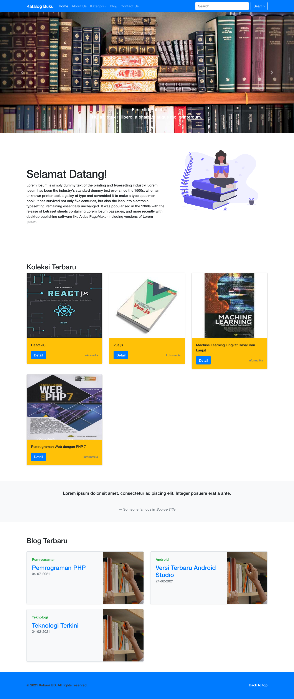

# Website Katalog Buku

Website Katalog Buku is a book catalogue website which contain information about list or record of books. Features included in this website are book list, blog, and admin page.

- Main page

    

- Admin page

    

## Installation

1. Clone this repository
    ```
    git clone https://github.com/harisfi/katalog_buku.git
    ```
2. Put this project in **htdocs** directory
3. Create a database with name **katalog_buku** and tables with structure below
    
4. Run XAMPP / LAMPP / WAMPP

## Member of group 6

- **[203140914111037 - MUHAMAD AL FAROBY](https://github.com/alfarobi695)**
- **[203140914111044 - MUHAMMAD HARIS FIRMANSYAH](https://github.com/harisfi)**
- **203140914111048 - BAYU WICAKSONO ARIANTO**
- **[203140914111056 - RAFLI ARIZAL RIFANDI](https://github.com/Rafliarzl)**
- **[203140914111061 - ZUELFIEKAR AKMIL RIDA](https://github.com/zuelfiekarar)**

## Contributing
Pull requests are welcome. For major changes, please open an issue first to discuss what you would like to change.

## License
[MIT](https://choosealicense.com/licenses/mit/)